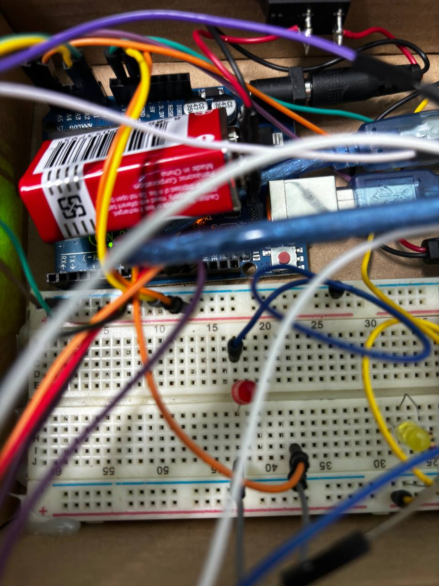
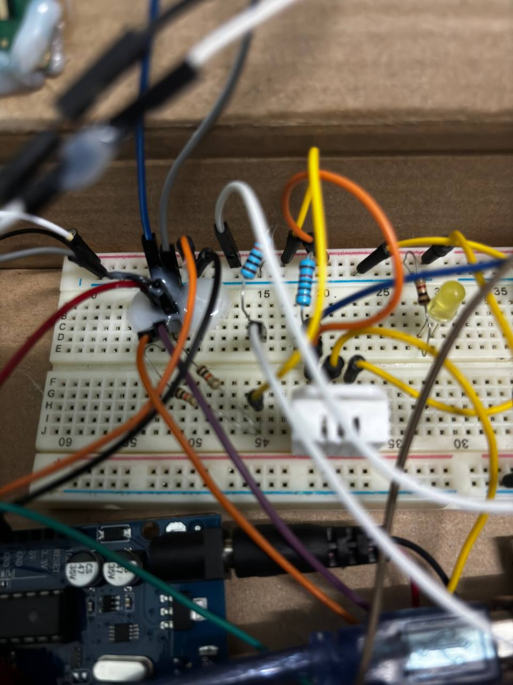

# Handheld Game Box with Temperature Detection

## Table of Contents
1. [Abstract](#abstract)
2. [Introduction](#introduction)
3. [Objectives](#objectives)
4. [Components](#components)
5. [Circuit Diagram](#circuit-diagram)
6. [Demo Diagram](#demo-diagram)
7. [Project Design](#project-design)
8. [Implementation](#implementation)
9. [Programming the Snake Game](#programming-the-snake-game)
10. [Testing and Troubleshooting](#testing-and-troubleshooting)
11. [Advantages](#advantages)
12. [Limitations](#limitations)
13. [Conclusion](#conclusion)

## Abstract
This project introduces a handheld game box equipped with temperature detection, catering to the need for portable entertainment and practical utility. Integrating classic gaming with real-time temperature monitoring, it offers a unique blend of fun and environmental awareness. Through innovative technology, this device enhances user experience while promoting awareness of surrounding conditions.

## Introduction
The Handheld Game Box with Temperature Detection is a dual-purpose device that merges gaming with environmental monitoring. This project is designed to provide users with entertainment while keeping them informed about the temperature of their surroundings. By integrating the classic Snake game and temperature monitoring capabilities, this device is suitable for on-the-go entertainment and real-time environmental awareness.

## Objectives
1. Develop a versatile and user-friendly handheld game box with temperature detection.
2. Optimize space utilization for efficient allocation of components.
3. Enhance user experience with intuitive controls and a clear interface.
4. Promote environmental awareness by providing accurate temperature readings.
5. Integrate sensors and actuators for precise temperature detection and management.
6. Continuously improve performance through testing and refinement for robustness.

## Components
| No. | Component                                | Quantity |
|-----|-----------------------------------------|----------|
| 1   | Arduino Uno                             | 2        |
| 2   | LCD 16×2 (I2C)                          | 1        |
| 3   | 16×16 Dot Matrix Display with MAX7219   | 1        |
| 4   | Button                                  | 2        |
| 5   | Buzzer                                  | 1        |
| 6   | Rocker Switch                           | 2        |
| 7   | Jumper Wires                            | -        |
| 8   | Resistors                               | 5        |
| 9   | DHT22 Sensor                            | 1        |
| 10  | Analog Joystick                         | 1        |
| 11  | Red LED                                 | 1        |

## Circuit Diagram
Below are the diagrams for the hardware connections:
1. **Slave Arduino Circuit Diagram**

    

2. **Master Arduino Circuit Diagram**

    

## Demo Diagram
Below are the Demo Diagrams of the hardware:
1. 
2. 
3. 
4. 
5. 


## Project Design
This project combines two Arduino Uno boards: one as a master and the other as a slave. The master Arduino handles the LCD display and temperature monitoring using a DHT22 sensor. The slave Arduino manages the Snake game displayed on a 16×16 dot matrix display, controlled through an analog joystick and buttons. The communication between Arduinos is achieved using the I2C protocol.

## Implementation
The Handheld Game Box with Temperature Detection integrates essential components such as the Arduino microcontroller, LCD display, temperature sensor, control buttons, and LED indicators. The LCD showcases Snake game scores and real-time temperature readings. Control buttons and LED indicators offer user interaction and visual cues.

The Arduino IDE is used for programming, incorporating game logic, temperature monitoring, and user interaction algorithms. Rigorous testing ensures proper functionality, delivering both portable entertainment and environmental monitoring.

## Programming the Snake Game
1. **Game Logic**: Code to manage the snake's movement, growth, and collision detection.
2. **User Interface**: Design the interface for game controls, score display, and level progression.
3. **Gameplay Mechanics**: Implement rules, speed adjustments, and win/lose conditions.

### Code Example
```cpp
// Example setup code for Snake game initialization
void setup() {
  // Initialize display, joystick, and other components
}

void loop() {
  // Implement game logic, update score, and display temperature
}
```

## Testing and Troubleshooting
1. **Functional Testing**: Test game performance, controls, and interaction under different scenarios.
2. **Troubleshooting**: Resolve any issues with wiring, coding errors, or component malfunctions.
3. **Enhancements**: Refine gameplay, controls, or visuals based on testing feedback.

## Advantages
1. **Compact Design**: Portable and space-efficient for on-the-go entertainment and monitoring.
2. **Dual Functionality**: Combines gaming and real-time temperature detection.
3. **Enhanced User Experience**: Offers Snake gameplay and temperature monitoring in one device.
4. **Environmental Awareness**: Empowers users with real-time temperature readings.
5. **Portability**: Lightweight design allows for easy transportation and usability.

## Limitations
1. **Limited Game Selection**: Only offers the Snake game, limiting variety.
2. **Screen Size Constraints**: Compact size may reduce visibility.
3. **Lack of Multiplayer Functionality**: Does not support multiplayer gaming.
4. **Limited Temperature Monitoring Range**: Restricted monitoring range for larger areas.
5. **Battery Life Dependency**: Requires frequent recharging for portable use.

## Conclusion
This project showcases the Handheld Game Box with Temperature Detection, a device that combines entertainment and environmental awareness. By merging classic Snake gameplay with real-time temperature monitoring, it demonstrates versatility in a compact, portable design. While it offers a significant advancement in portable devices, further refinement could make it a must-have companion for various settings.